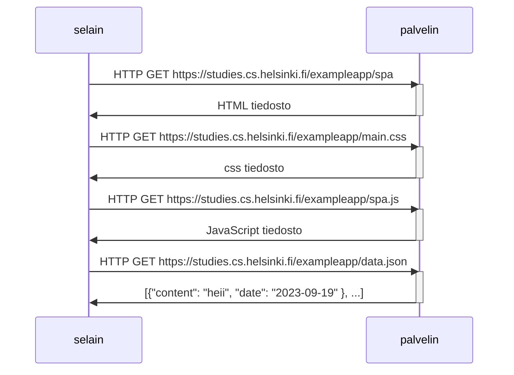

```mermaid
sequenceDiagram
    participant selain
    participant palvelin

    selain->>palvelin: HTTP GET https://studies.cs.helsinki.fi/exampleapp/spa 
    activate palvelin
    palvelin->>selain: HTML tiedosto
    deactivate palvelin

    selain->>palvelin: HTTP GET https://studies.cs.helsinki.fi/exampleapp/main.css 
    activate palvelin
    palvelin->>selain: css tiedosto
    deactivate palvelin

    selain->>palvelin: HTTP GET https://studies.cs.helsinki.fi/exampleapp/spa.js
    activate palvelin
    palvelin->>selain: JavaScript tiedosto
    deactivate palvelin

    selain->>palvelin: HTTP GET https://studies.cs.helsinki.fi/exampleapp/data.json
    activate palvelin
    palvelin->>selain: [{"content": "heii", "date": "2023-09-19" }, ...]
    deactivate palvelin
```

